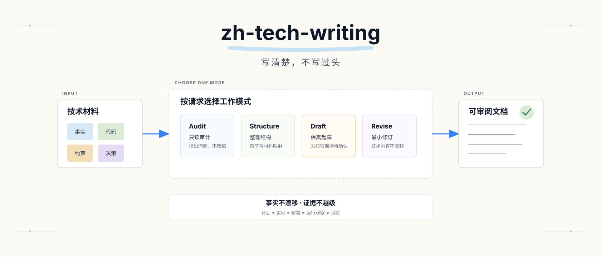
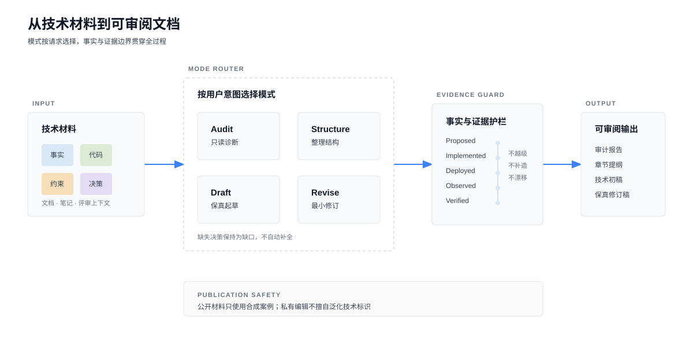

<p align="center">
  
</p>

# zh-tech-writing

面向简体中文技术文档的 AI Skill：审计结构、整理材料、保真起草与修订，严格区分事实、建议与验证证据。

*Evidence-aware writing for Simplified Chinese technical documents.*

## 为什么做这个 Skill

技术材料交给 AI 后，常见问题并不只是“文风像 AI”：

- 事实、推论和建议混在一起，结论强于证据；
- 计划、实现、部署、运行观察与验收被写成同一种“已完成”；
- `赋能`、`闭环`、`底座` 等抽象词替代了组件、动作和约束；
- 标题很多，但读者找不到目标、决策、边界、失败策略和验证方式；
- 润色过程中，数字、术语、代码、链接或责任边界发生漂移；
- 为了让初稿看起来完整，模型补出了并不存在的接口、结果或因果。

`zh-tech-writing` 把这些问题拆成可复用的写作规则，同时保留作者的技术判断与授权边界。

## 四种模式

| 模式 | 适用请求 | 默认行为 |
|---|---|---|
| Audit | “看看”“审一下”“不改” | 只读诊断结构、语言和证据，不生成替换稿 |
| Structure | “整理提纲”“重排结构” | 给出章节职责和材料映射，缺口显式标记 |
| Draft | “根据这些材料写一版方案” | 只用已给事实形成可用初稿，不补造未知项 |
| Revise | “润色”“去 AI 味”“改自然” | 保留技术内容，做最小有效修改 |



## 快速开始

### 安装

```bash
npx skills add statefulai/zh-tech-writing
```

安装器会检测兼容的 Agent Skills 宿主，例如 Codex、Cursor、Claude Code 和其他支持同一格式的工具。

本地开发也可以直接建立链接：

```bash
# Codex / 通用 Agent Skills
ln -s "$(pwd)" ~/.agents/skills/zh-tech-writing

# Cursor
ln -s "$(pwd)" ~/.cursor/skills/zh-tech-writing
```

### 使用

显式调用：

```text
Use $zh-tech-writing 只读审计 design.md，重点检查结构和证据强度，不改文件。
```

```text
Use $zh-tech-writing 根据 meeting-notes.md 起草技术方案，缺失决策保留 [待确认]。
```

```text
Use $zh-tech-writing 润色 proposal.md，代码块、表格、数字和链接保持不变。
```

Skill 默认允许宿主按描述隐式匹配；是否真正自动触发取决于具体宿主及其本地配置。

## 一个合成示例

原文：

> 示例平台通过智能化能力全面打通告警闭环，显著提升研发质量。当前仅完成事件解析模块，尚未接入生产告警通道。

保真修订：

> 当前已完成事件解析模块，生产告警通道尚未接入。因此，现有证据只能证明解析能力已经实现，不能据此判断告警链路已经投入运行或改善了研发质量。

修改发生在表达和证据边界，不是技术事实本身。

## 证据状态

| 状态 | 表达边界 |
|---|---|
| Proposed | 已形成计划或决策，尚未证明实现 |
| Implemented | 源码或配置存在，尚未证明已运行 |
| Deployed | 制品或配置已发布到指定环境 |
| Observed | 已直接观察到运行行为或指标 |
| Verified | 已在明确条件下通过验收证据 |

前一状态不能自动推出后一状态。

## 技术内容保护

未经明确授权，Skill 应保留：

- 数字、日期、单位、版本和标识符；
- 代码、命令、配置、Schema 和 API 示例；
- 表格、链接、引用及其支持的主张；
- 术语、不确定性、非目标、归属和责任边界。

发现疑似技术错误时，先标记并请求确认，不静默改成另一套方案。

## 公开发布与脱敏

开源仓库中的 README、示例、评测和视觉资产只使用合成材料：

- 不包含真实公司、人员、客户或内部系统名称；
- 不包含私有域名、仓库、分支、工单、截图、日志或指标；
- 使用 `example.com`、`example.invalid` 等保留域；
- 改变场景和数据模型，而不是只替换几个名词。

这不意味着 Skill 会自动清洗用户的私有文档。脱敏是显式的发布操作；私有编辑默认保留必要的内部技术标识。

## 与 statefulai/tech-report 的区别

| 项目 | 输入 | 主要产出 | 触发方式 |
|---|---|---|---|
| `zh-tech-writing` | 技术文档、笔记、已知事实与决策 | 审计、提纲、初稿或修订稿 | 技术写作意图，可显式调用 |
| [`tech-report`](https://github.com/statefulai/tech-report) | 代码、commit diff、文档链接、架构描述 | 结构化中文技术报告及可选图表 | `@report` 显式触发 |

`tech-report` 负责从技术输入生成报告；`zh-tech-writing` 负责控制中文技术文档的结构、表达、证据强度和保真修改。

## 目录结构

```text
.
├── SKILL.md                    # Skill 入口与模式路由
├── agents/openai.yaml          # Codex / ChatGPT UI 元数据
├── references/                 # 按需加载的结构、写作与发布规则
├── evals/                      # 纯合成行为评测与不变量
├── assets/                     # README 封面与工作流图
├── NOTICE
└── LICENSE
```

v0.1 保持 instruction-only，不要求 API、MCP 或运行脚本。

## 能力边界

- 不代替技术评审，也不判断未提供代码或运行证据的真实性；
- 不为了“人味”添加口语、故事、错别字或虚构经历；
- 不承诺通过 AI 文本检测器；
- 不在只读请求中修改文件、Git、配置或外部系统；
- 不把一套章节模板强制套到所有文档。

## 开发与验证

评测关注行为不变量，不比较固定措辞：

- 事实和证据强度是否保持；
- 代码、数字、链接和限定词是否保留；
- 缺失决策是否保持为缺口；
- 只读授权是否得到遵守；
- 非技术写作请求是否避免误触发；
- 公开仓库是否只包含合成材料。

测试定义见 [`evals/`](evals/)。

## 致谢

设计过程中参考了以下 MIT 开源项目的公开思路：

- [`luoling8192/technical-writing`](https://github.com/luoling8192/technical-writing)
- [`LifelongLazyLearner/qu-ai-wei`](https://github.com/LifelongLazyLearner/qu-ai-wei)

本项目的规则和合成评测独立编写。详见 [NOTICE](NOTICE)。

## License

MIT License. See [LICENSE](LICENSE).
